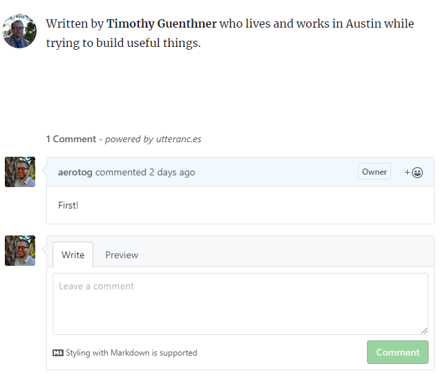

Wouldn't it be nice to allow the community to interact with my blog? Surely it can't be that difficult! I bet I can get it done in an afternoon.

_Six hours later..._

Well that took longer than I expected.

The comment section should now appear if the user click the "Load comments" hyperlink or if they directly browse to a blog post. Users can authenticate using Github OAuth. Comments are saved in issues on my blog project so no storage other than Github is needed. A bit of a hacky solution, but I love the clever repurposing of Github's features.

So how did I get here?

I first considerd my options. I wanted to stick to a "serverless" solution, so hosting my open comment API would be my last resort. Of course I'll continue to use static site generation via Gatsby.

The possible solutions I considered included:
- <a href="https://staticman.net/">Staticman</a>
	- This seems like a comprehensive solution. It enables user generated content on a static site by pushing content to the site's Github repository by way of Statisman's private API. I do like the concept, but I feel having commits for every comment is a bit troublesome.
- <a href="https://github.com/gitalk/gitalk">Gitalk</a>
	- It's a React component that uses your personal Github OAuth application token to post comments as issues to a repo you own. I love the concept of using Github issues as comment threads. However, it has two deal breakers:
		- It requires the "window" browser global. Unfortunately, since Gatsby uses Server Side Rendering, both the "window" and "document" globals are unavailable. Gatsby does provide a workaround for this, but in short it is "ensure the code doesn't run unless it's rendered in the browser". So the code we want to run won't work.
		- Also, for Gitalk to work, _you must provide your Github OAuth Client Secret to the user's client_. This could easily be abused by 3rd parties, so it's probably best not to do this.
- <a href="https://github.com/utterance/utterances">Utterances</a>
	- Like Gitalk, Utterances uses Github issues to store comments. The primary difference is it has its own Github app that hosts the API used for posting comments so you don't need to provide your own OAuth key. The configuration is very simple and as long as your repo allows public issues, it seems the easiest to implement with the fewest risks.

After trying to use Gitalk and realizing 1) it won't work with SSR and 2) it requires a secret I don't want to reveal, I quickly moved on to Utterances.

Utterances is simple to implement. It walks you through configuration and <a href="https://utteranc.es/">generates an HTML script block</a> you can plug into your web page.

With the smell of victory in the air, I added it to my blog template:
	
```html
			<footer>
				<Bio />
			</footer>
			<script async src="https://utteranc.es/client.js"
				repo="aerotog/blog"
				issue-term="title"
				theme="github-light"
				crossorigin="anonymous">
			</script> 
		</section>        
	</article>
```
	

It didn't work.

A quick google search later, I [found a most relevant blog post](https://dev.to/creativcoder/how-to-add-comment-support-on-your-gatsby-blog-using-github-utterances-423n). This walkthrough uses the React "useEffect" hook to populate a "Comment" component consisting of a single "comments" class div. Pretty straight forward.

After some quick modifications and serving the site with "gatsby develop", I had working comments! Or so I thought.

Yes, they worked with "gatsby develop". But as soon as I ran "gatsby build" and tried accessing my static site, the comment element did not appear.

After a bit more research, I found the problem. Because Gatsby uses Server Side Rendering for its static site generation, client side triggers like componentDidMount() and hooks like useEffect() <a href="https://blog.logrocket.com/fixing-gatsbys-rehydration-issue/">_do not run_</a>.

I took a moment to re-evaluate what I've tried. The useEffect() solution was not compatible with my page generation strategy. But I never fully investigated why adding the JS to the blog template didn't work.

My understanding of React component templating lead me to believe I could add HTML blocks at will, like the script block I wanted. To better deduce why it wasn't working, I replaced the JS with a simple console statement. But even a simple `console.log("Hello world")` was failing to execute.

Pursuing methods for adding script blocks to React components lead me to suggestions for Gatsby which included creating a `gatsby-ssr.js` file or modifying the `default-html.js`. But eventually I found what I really wanted: <a href="https://reactjs.org/docs/dom-elements.html#dangerouslysetinnerhtml">dangerouslySetInnerHTML</a>. This ominous method has pitfalls and risks with rendering unsanitized HTML in your page (you shouldn't use it without considering the risks) but _this_ is how you can render HTML at will:

```html
      <section id="comments">
        <h4><a href="">Load comments</a></h4>
        <div dangerouslySetInnerHTML={{ __html: 
          `<script async src="https://utteranc.es/client.js"
            repo="aerotog/blog"
            issue-term="title"
            theme="github-light"
            crossorigin="anonymous">
          </script>`
        }} />
      </section>
```

Dangerous HTML in hand, I once again had working comments. This time in my static site!



There was one final problem. The comments would only load when I directly browsed to a blog post or refreshed the page. If I was navigating the site using its links, the blog post content would change, but the comments would never load.

After some thinking, I realized this was caused by the fundamental nature of React apps. One of the _key features_ of React is that it can dynamically change content on a page without reloading/navigating away. This makes React apps incredibly responsive, but it has the side effect of breaking my comments!

I considered ways around this. I thought about force reloading the page, but I didn't like taking control away from the user. Especially for people like me who don't often read comments, sacrificing usability for an unused/unwanted feature was not appealing.

So I gave control to the user. As seen at the bottom of the page, I added a "Load comments" link that refreshes the page which in turn makes the comments render. It's not ideal, but I think it's an acceptable compromise. If someone is really wanting to read/write comments, hopefully a single click isn't enough to deter them.

Long live the comments! I'm sure this feature will endure the tests of time! Or at least until the <a href="https://utteranc.es/">Utterances</a> API is shut down.

~EOF~